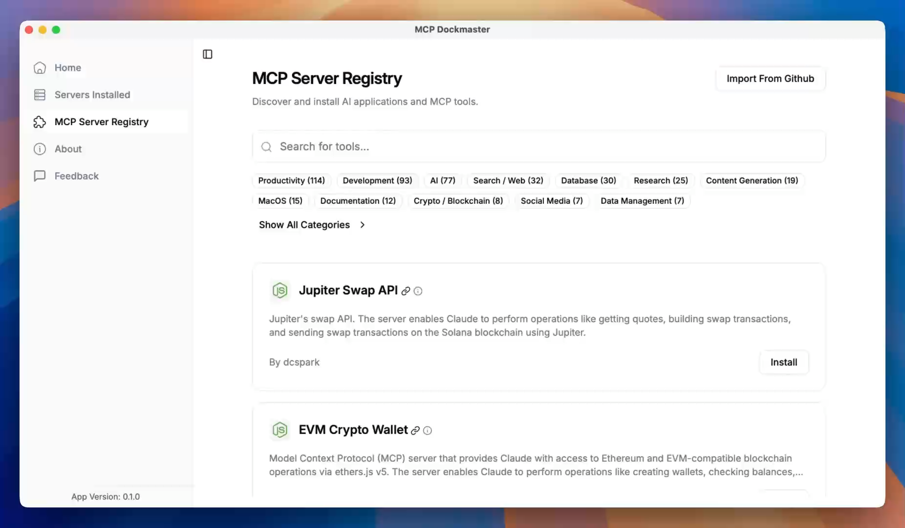

# MCP Dockmaster

MCP Dockmaster 允许您轻松安装和管理 MCP 服务器。作为桌面应用程序、命令行界面（CLI）和库，支持 Mac、Windows 和 Linux。

## 演示

[](https://mcp-dockmaster.com/dockmaster-demo.mp4)

<video src="https://mcp-dockmaster.com/dockmaster-demo.mp4" controls></video>

<!-- 如果视频嵌入无法正常工作，这里提供直接链接 -->
[观看演示视频](https://mcp-dockmaster.com/dockmaster-demo.mp4)

# MCP Dockmaster 单体仓库

这是 MCP Dockmaster 项目的单体仓库，使用 NX 进行管理。单体仓库是一个包含多个项目的单一代码库，这些项目可以是相关的也可以是独立的。NX 是一套用于单体仓库的可扩展开发工具，有助于高效管理和扩展项目。

## 结构

- `apps/mcp-dockmaster`：主 Tauri 应用程序，这是一个使用 Tauri 框架构建的桌面应用程序，Tauri 是一个用于为所有主要桌面平台构建小巧、快速二进制文件的框架。
- `apps/mcp-proxy-server`：MCP 代理服务器，负责处理网络请求并作为客户端与服务器之间的中间件。

## 快速入门

### 前提条件

- Node.js（v18 或更高版本）：基于 Chrome V8 JavaScript 引擎构建的 JavaScript 运行时。
- npm（v8 或更高版本）：JavaScript 的包管理器，随 Node.js 一起提供。

### 安装

1. 使用 Git 克隆仓库，Git 是一个分布式版本控制系统。
2. 使用 `npm ci` 安装依赖项，此命令从锁文件安装依赖项，确保环境一致性。

## 开发

### 运行应用程序

运行 Dockmaster 应用程序：

```bash
npx nx dev mcp-dockmaster
```
此命令启动 Dockmaster 应用程序的开发服务器。

进行 Tauri 开发：

```bash
npx nx tauri:dev mcp-dockmaster
```
此命令用于开发 Tauri 应用程序，提供实时重载环境。

构建 MCP Runner：

```bash
npx nx build mcp-proxy-server
```
此命令编译 MCP 代理服务器，为生产部署做好准备。

### 在所有项目中运行命令

```bash
# 构建所有项目
npx nx run-many -t build
```
此命令构建单体仓库中的所有项目。

```bash
# 在所有项目中运行测试
npx nx run-many -t test
```
此命令为所有项目运行测试，确保代码质量和功能。

```bash
# 检查所有项目的代码规范
npx nx run-many -t lint
```
此命令检查代码中的潜在错误并强制执行编码标准。

## 使用 NX

### 运行任务

```bash
# 为特定项目运行任务
npx nx <task> <project>
```
此命令允许您为特定项目运行特定任务，例如构建或测试。

### 可视化项目依赖图

```bash
npx nx graph
```
此命令生成项目依赖关系的可视化表示，帮助您理解单体仓库中不同部分之间的关系。

### 并行运行任务

```bash
npx nx run-many --target=build --parallel=3
```
此命令并行运行多个任务，提高效率并减少构建时间。

### 受影响的命令

```bash
# 仅为受更改影响的项目运行任务
npx nx affected --target=build
```
此命令通过仅为已修改的项目运行任务来优化构建过程，从而节省时间和资源。

## 了解更多

- [NX 文档](https://nx.dev) 
官方 NX 文档提供了全面的指南和 API 参考，帮助您充分利用 NX。